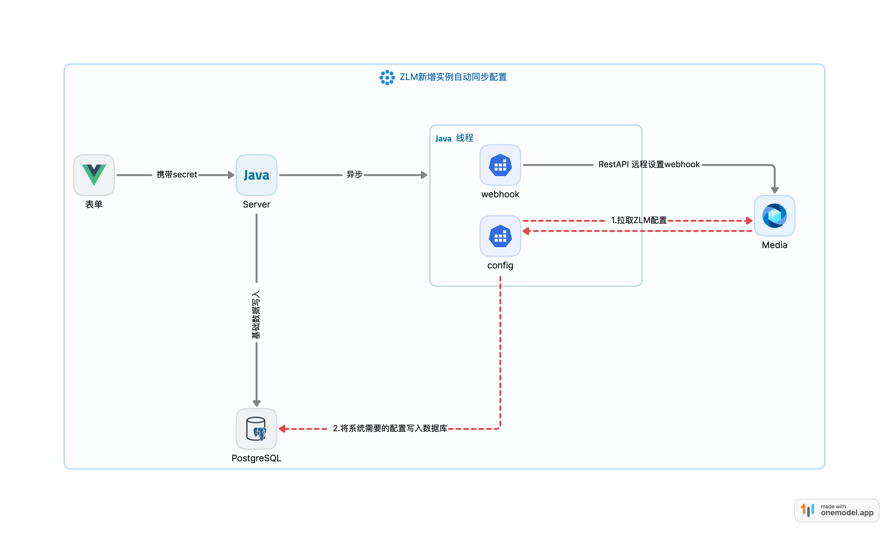

# SugarIOT-Media-UI


### 环境要求

1. Node.js >=20.15.0 

### 安装项目依赖

```bash
pnpm install
```

### 运行
```bash
pnpm run dev
```

#### 参考文档

1. [Naive UI](https://www.naiveui.com/zh-CN/light/docs/introduction)
2. [Vben Admin](https://doc.vben.pro/guide/introduction/vben.html)
3. [ICON](https://icones.js.org/)
4. [VUE3](https://cn.vuejs.org/guide/quick-start.html)
5. [Zod](https://zod.dev/?id=numbers)
6. [Easyplayer](https://www.tsingsee.com/easyplayer/)


#### 参考设计

1. ZLM同步配置设计

